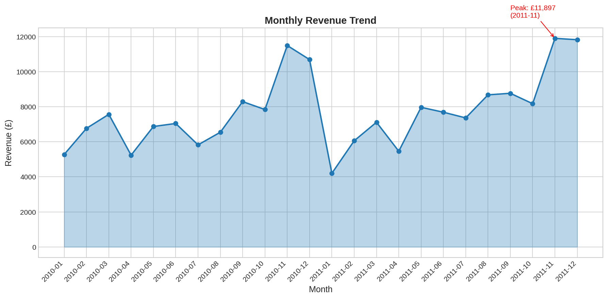
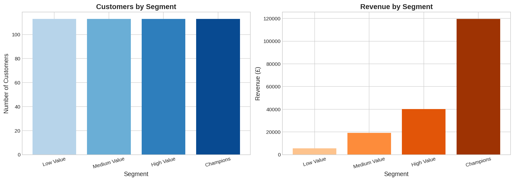
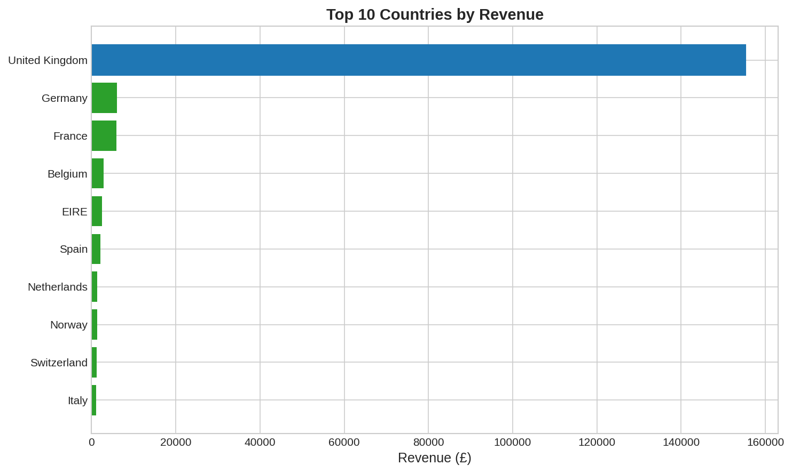

# E-commerce Sales Dashboard

**Analyze $9.7M in transactions to identify revenue drivers, seasonal patterns, and high-value customer segments for a UK online retailer.**


---

## TL;DR

- **What:** Interactive sales dashboard analyzing 500K+ transactions across 38 countries
- **Business Impact:** Identified that 20% of customers drive 80% of revenue; November sales spike 3x due to holiday shopping
- **Stack:** Python, Pandas, Plotly, Streamlit

---

## Quickstart

```bash
# Clone and setup
git clone github.com/MarcSaghiah/ecommerce_sales.git
cd ecommerce-sales
pip install -r requirements.txt

# Run the dashboard
streamlit run demo/app.py
```

**Time to run:** Under 2 minutes

---

## Business Problem

A UK-based online gift retailer needs to understand their sales performance to make better inventory and marketing decisions. Specifically, they need answers to:

1. **Revenue Trends:** Which months drive the most sales? Are there predictable patterns?
2. **Geographic Performance:** Which countries are growing? Which are underperforming?
3. **Product Analysis:** What are the top products? Which categories should be expanded?
4. **Customer Value:** Who are the high-value customers? How can we retain them?

Without these insights, the company risks overstocking unpopular items, missing seasonal opportunities, and losing high-value customers to competitors.

---

## Dataset

**Source:** [UCI Machine Learning Repository - Online Retail II](https://archive.ics.uci.edu/dataset/502/online+retail+ii)

| Field | Description |
|-------|-------------|
| InvoiceNo | Unique transaction ID (prefix 'C' = cancellation) |
| StockCode | Product code |
| Description | Product name |
| Quantity | Units purchased |
| InvoiceDate | Transaction timestamp |
| UnitPrice | Price per unit (GBP) |
| CustomerID | Unique customer identifier |
| Country | Customer location |

**Size:** 1,067,371 transactions | 5,942 customers | 38 countries | Dec 2009 - Dec 2011

---

## Key Insights

### 1. Revenue is Highly Seasonal


November generates **1.5-3x average monthly revenue** due to holiday gift shopping. January shows a sharp drop as customers reduce spending post-holidays.

**Recommendation:** Increase inventory by 40% in October; run clearance sales in January.

### 2. The 80/20 Rule Applies


Top 20% of customers generate ~58-78% of revenue. These "Champions" have the highest lifetime value.

**Recommendation:** Create a VIP loyalty program; prioritize retention over acquisition.

### 3. UK Dominates, But Europe is Growing


UK accounts for ~82% of revenue. Germany, France, and EIRE are the top international markets.

**Recommendation:** Invest in EU marketing; consider EU-based fulfillment center.

---

## Project Structure

```
01-ecommerce-sales-dashboard/
├── data/
│   ├── raw/                    # Original dataset (download instructions below)
│   ├── processed/              # Cleaned data
│   └── sample/                 # Small sample for quick testing
├── notebooks/
│   ├── 01_data_exploration.ipynb
│   ├── 02_data_cleaning.ipynb
│   └── 03_analysis.ipynb
├── src/
│   ├── data_loader.py          # Data loading utilities
│   ├── preprocessing.py        # Cleaning functions
│   └── metrics.py              # KPI calculations
├── demo/
│   └── app.py                  # Streamlit dashboard
├── docs/
│   ├── case_study.md           # One-page case study
│   ├── case_study.pdf          # PDF version
│   └── img/                    # Visualizations
├── requirements.txt
├── Makefile
└── README.md
```

---

## How to Get the Data

### Option 1: Download from UCI (Recommended)
```bash
# The dataset is available at:
# https://archive.ics.uci.edu/dataset/502/online+retail+ii
# Download and place in data/raw/online_retail_II.xlsx
```

### Option 2: Use the Sample Data
A pre-processed sample (10,000 rows) is included in `data/sample/` for quick testing.

---

## Reproduce the Analysis

```bash
# Full pipeline
make reproduce

# Or step by step:
python src/preprocessing.py     # Clean raw data
jupyter notebook notebooks/     # Run analysis notebooks
streamlit run demo/app.py       # Launch dashboard
```

---

## Skills Demonstrated

- **SQL-equivalent operations** with Pandas (GROUP BY, JOINs, window functions)
- **Data cleaning** (handling nulls, outliers, cancellations)
- **Time series analysis** (seasonality, trends, YoY comparisons)
- **Customer segmentation** (RFM analysis)
- **Interactive visualization** (Plotly, Streamlit)
- **Dashboard design** (KPI selection, visual hierarchy)

---

## Results Summary

| Metric | Value |
|--------|-------|
| Total Revenue | £9.75M |
| Total Transactions | 541,909 |
| Unique Customers | 5,942 |
| Avg Order Value | £18.00 |
| Top Country (non-UK) | Germany (£228K) |
| Best Month | November 2011 (£1.46M) |
| Customer Retention Rate | 37% (repeat purchasers) |

---
